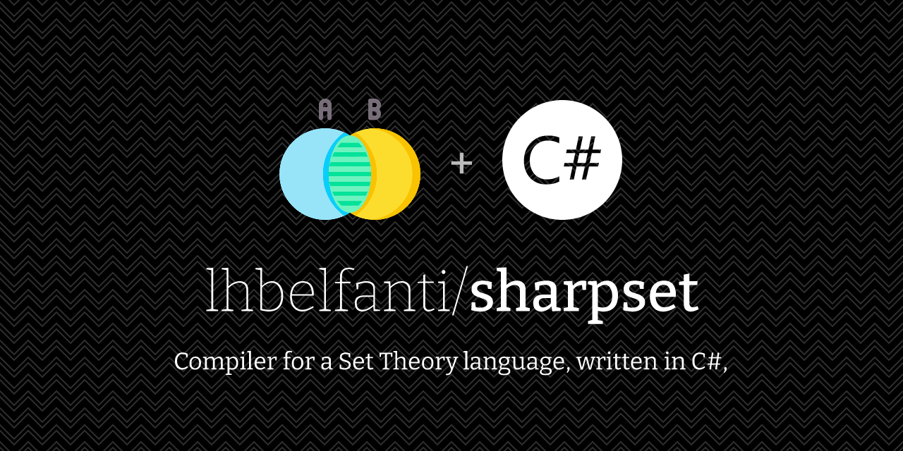

  <picture>
    <source media="(prefers-color-scheme: dark)" srcset="media/sharpset-dark.png">
    <source media="(prefers-color-scheme: light)" srcset="media/sharpset-light.png">
    
  </picture>

   

  
  

## Language definitions

* [Assignation & Variables](#variables)
  + [Examples](#examples)
* [Show](#show)
  + [Examples](#examples-1)
* [Set](#set)
  + [Examples](#examples-2)
* [Max](#max)
  + [Examples](#examples-3)
* [Min](#min)
  + [Examples](#examples-4)
* [Avg](#avg)
  + [Examples](#examples-5)
* [Ext](#ext)
  + [Examples](#examples-6)

### Assignation & Variables 

Assigns a `set` to a `variable`, or a `variable` to a `variable`.

#### Examples
- `a = [6,2]` → assign the set `[6,2]` to `a`
- `c = a` → assigns the value of the variable `a` to the variable `c` (`a` must be defined)

### show

Prints the value of a `variable`.

#### Examples
- `a = [2]` `show a` → prints `[2]`

### set

Creates a `set` based on three parameter:
 - `from`: The number where the set will start from
 - `to`: The number where the set will end - the `jump`
 - `jump`: Steps 

#### Examples
- `b = set(10,50,2)` → create a `set` from 10 to 50 with a jump of 2: `[10,12,14,16,18,20,22,24,26,28,30,32,34,36,38,40,42,44,46,48]`

### max

Returns the `max` value from a `set`.

#### Examples

- `a = [1, 9]` `max a` → returns `[9]`

### min

Returns the `min` value from a `set`.

#### Examples

- `a = [1, 9]` `min a` → returns `[1]`

### avg
Returns the `avg` value from a `set`.

#### Examples

- `a = [1, 9]` `avg a` → returns `[5]`

### ext
Removes a value from a `set`, based on the following parameters:
- `variable`: The variable containing the `set`
- `index`: The index number of the `set` that will be removed. Consider the `set` as an array where the index `0` is the first element

#### Examples

- `a = [1, 5, 9]` `ext a,0` → removes the first element from the `set`, so, the result will be the `set` without that element → `[5,9]`

### ANTLR4
The grammar of this project is defined inside the [SetTheory.g4](./SetTheoryCompiler/SetTheory.g4)

## Examples
Inside the SetTheoryCompiler Project, there is a [Program.cs](./SetTheoryCompiler/Program.cs) file that contains many examples of how the different operations work.

---
## License

[MIT](https://choosealicense.com/licenses/mit/)

